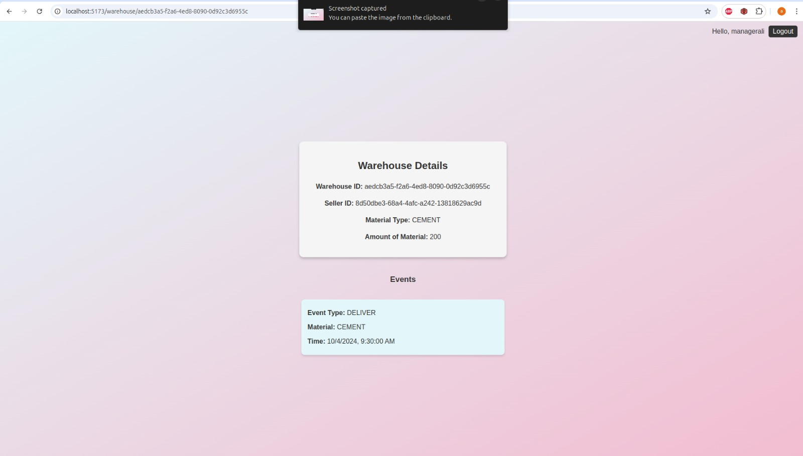
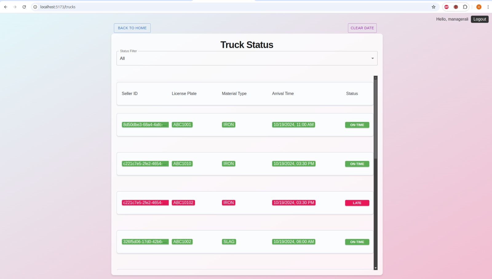
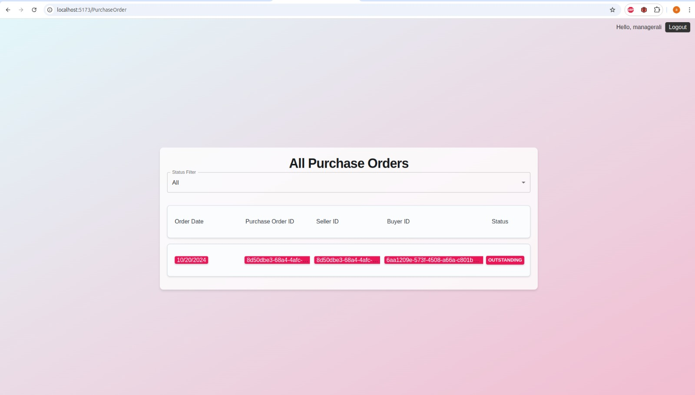
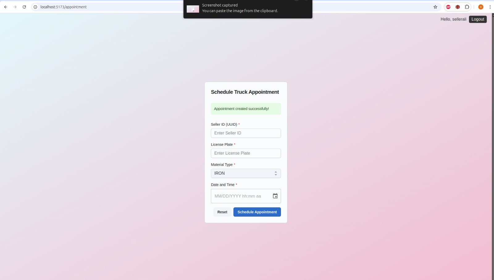

# WeighBridge and Warehouse System

### 1. **LandsideBoundedContext**
# DOMAIN:

# DayCalendar 
     acts as the root entity, managing a list of Appointment objects for a specific date.
    It is responsible for creating appointments and handling other operations related to appointments. When needed, it delegates specific tasks to the Appointment .

# Warehouse 
     The Warehouse class in the land-side context mirrors the warehouse-side’s storage capacity, providing up-to-date information on material storage. It is used when scheduling appointments to check if the warehouse can accommodate the materials.

# The WeighbridgeTicket
    - class records data for truck weigh-in and weigh-out.
    - Weigh-in (Truck Entry): When a truck enters, it records the startWeight (truck weight plus material weight), startTime, materialType, and licensePlate.
    - Weigh-out (Truck Exit): When the truck exits, it records the endWeight (material weight alone, without the truck) and endTime, indicating the time the truck has left after unloading the material.

#####
# WarehouseSide 

# PurchaseOrder
    The PurchaseOrder class represents a customer’s order, including details like the order date, unique order ID (purchaseOrderId), seller ID, customer name, buyer ID, and a list of ordered items (orderLines)
    Each PurchaseOrderLine within orderLines specifies a distinct material being ordered, the quantity (in tons), and the price per ton. This setup allows a single purchase order to include multiple materials, each with its specific amount and price

# Warehouse (Root Aggregate)
     The Warehouse class serves as the main entity for managing material storage 
     uniquely identified by its warehouseNumber and associated with a specific sellerId and materialType.
     it also include a WarehouseEventsWindow object the child 

# WarehouseEventsWindow 
    WarehouseEventsWindow  holds a list of WarehouseEvent objects, which each represent a specific storage action (such as adding or removing material). This list acts as an event store and enables event sourcing, meaning the current state of material inventory can be derived by replaying all events in the list
    

# WarehouseEvent (Event)
    Each WarehouseEvent represents a single action that impacts warehouse storage
    Type: EventType specifies  whether theevent is a DELIVER or SHIP.
    Material Weight: The amount of material involved in the event.
    Timestamp: The time the event occurred.
    Material Type: The specific material affected.

#####

# WaterSide
    
    The ShipmentOrder class tracks a vessel’s shipment process, including expected and actual arrival and departure times, the vessel ID, purchase order that is point to a valid  purchase order , and shipment status. It also manages two key operations: BunkeringOperation (refueling) and InspectionOperation (inspection), both of which must be completed before the ship is allowed to depart.
    BunkeringOperation records the refueling time and is considered complete when a time is set.
    InspectionOperation records the inspection signature and time, and is complete when a valid signature is provided.

# FrontEnd Images
    
# manager view

# seller View 

